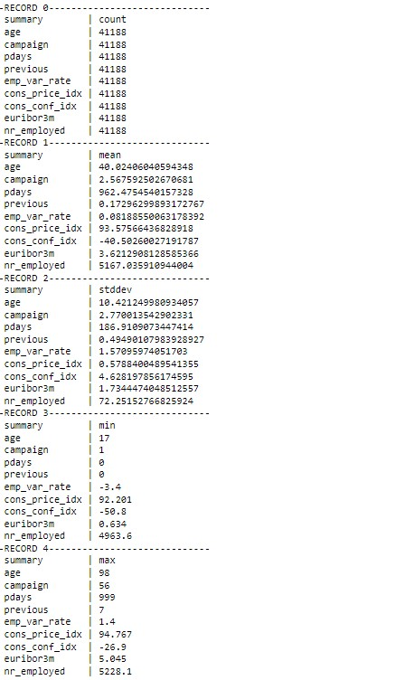
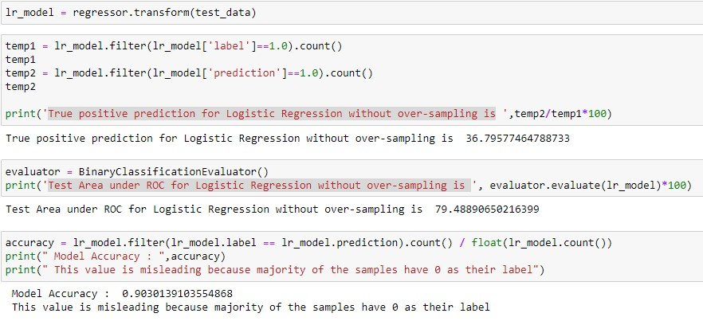

# Data Processing and Classification using Spark and SMOTE

## Goal
_The aim of this project is to predict potential customers who may opt for a term insurance given their past details like credit history, job etc. This is a use case for sales analytics and can greatly reduce the workload of bank's sales and marketing team, as now they may call only to the clients who are likely to opt for the term insurance._

The model is made using PySpark and its MLlib library.
## _Machine learning models used - Logistic Regression and Random Forest_

### Data
Data is fetched from https://www.kaggle.com/alexkataev/bank-marketing-data-set in the form of csv. The data features are explained in detail in the bank-additional-names.txt attached.

### Data Schema - 


### Data Processsing

_renaming columns having '.' with '\_' to avoid clash in spark_
```
def rename_cols(df):
    for column in df.columns:
        new_column = column.replace('.','_')
        df = df.withColumnRenamed(column, new_column)
    return df
df_pyspark = rename_cols(df_pyspark)

columns = ['job','marital','education','default','housing','loan','contact','month','day_of_week','poutcome','y']
print(df_pyspark.count(),df_pyspark.na.drop(how="any").count())
print('No null values present')
```

_Checking numeric data's description for better understanding_

```
df_pyspark.select('age','campaign','pdays','previous','emp_var_rate','cons_price_idx',
                  'cons_conf_idx','euribor3m','nr_employed').describe().show(n=5, truncate=False, vertical=True)
```



_Data transformation begins_
```
df_pyspark = df_pyspark.filter(df_pyspark['duration']>0)
df_pyspark.count() # duration = 0 means y = 0 regardless of other attributes hence dropping these tuple

df_pyspark = df_pyspark.drop('duration') #if the call happens we already know the answer of the customer, 

```
_hence to make it a realisitic predictive model I am dropping the duration column._

#### Unknowns in the columns

```
def number_unknowns(df):
    print("No of unknowns:")
    for column in columns:
        print(column,df.filter(df[column]=='unknown').count())
    return

number_unknowns(df_pyspark)
```


_As no. of unknown's percentage is low, there is no need to drop the columns and unknown will
treated as a separate category except job and education_

#### Imputing unknowns in job and education column
```
temp = df_pyspark.filter(df_pyspark['job'] == 'unknown')
temp = temp.groupBy('education').count()
temp.sort(col('count').desc()).show() 

temp = df_pyspark.filter(df_pyspark['education'] == 'unknown')
temp = temp.groupBy('job').count()
temp.sort(col('count').desc()).show() 

temp = df_pyspark.filter(df_pyspark['job'] == 'blue-collar')
temp = temp.groupBy('education').count()
temp.sort(col('count').desc()).show() 
```
 - _when job is unknown most likely the job is blue-collar hence the 
unknowns in job are replaced with blue-collar_
 - _when education is unknown most likely the education is basic.9y hence the unknowns 
in education are replaced with basic.9y_

#### Converting categorcial string columns into numerical ones
```
def convert_categorical(df,inputCol,new_column):
    indexer = StringIndexer(inputCol=column, outputCol=new_column)
    indexed = indexer.fit(df).transform(df)
    return indexed


columns_final = ['Jobf','Maritalf','Educationf','Defaultf','Housingf','Loanf','Contactf',
                 'Monthf','Day_of_weekf','Poutcomef','label']

i = 0
for column in columns:
    new_column = columns_final[i]
    i+=1
    df_pyspark = convert_categorical(df_pyspark,column,new_column)
```
## SMOTE(Oversampling)


As this dataset is clearly unbalanced, there is a need to balance the minority class to avoid the bias of the model. Hence SMOTE is used to rectify this problem.
_SMOTE is an oversampling technique where the synthetic samples are generated for the minority class. This algorithm helps to overcome the overfitting problem posed by random oversampling. It focuses on the feature space to generate new instances with the help of interpolation between the positive instances that lie together._

```
sm = SMOTE(sampling_strategy = 'not majority', k_neighbors = 50, random_state = 202)
features, labels = sm.fit_resample(features, labels)
```
### Classification without oversampling
_A receiver operating characteristic curve, or ROC curve is used for model evaluation. ROC is a probability curve and AUC represents degree or measure of separability. ROC tells how much model is capable of distinguishing between classes._

#### Logistic Regression

```
trainingSummary = regressor.summary
roc = trainingSummary.roc.toPandas()
plt.plot(roc['FPR'],roc['TPR'])
plt.ylabel('False Positive Rate')
plt.xlabel('True Positive Rate')
plt.title('ROC Curve')
plt.show()
print('Training set areaUnderROC: ' + str(trainingSummary.areaUnderROC))
```




#### Random Forest


### Classification with oversampling(SMOTE)

#### Logistic Regression
```
trainingSummary = regressor_smote.summary
roc = trainingSummary.roc.toPandas()
plt.plot(roc['FPR'],roc['TPR'])
plt.ylabel('False Positive Rate')
plt.xlabel('True Positive Rate')
plt.title('ROC Curve')
plt.show()
print('Training set areaUnderROC for Logistic Regression with SMOTE = ' + str(trainingSummary.areaUnderROC))
```


#### Random Forest


## Conclusion

The model performed very well with Random Forest model with oversasmpling coming out as the best. It displayed an excellent area under ROC of 89% and accuracy of 81%. More importantly the true positive percentage(_how accurately it predicts if a customer will opt for term insurance_) increased from 26% to 89% using SMOTE. This means if the output label is 1, there is 89% chance that the customer will buy the term insurance.

Howover without oversampling both Random Forest and Logistic Regression displayed almost similar results with bias for the majority class i.e a customer will not opt for a term insurance.
